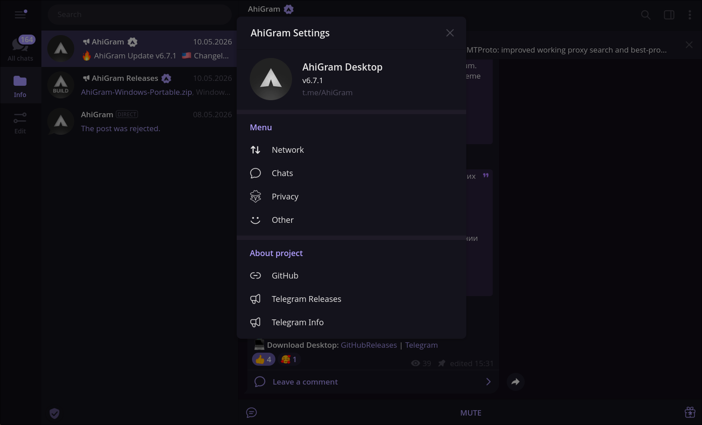

# AhiGram Desktop

Unofficial fork of [Telegram Desktop](https://github.com/telegramdesktop/tdesktop) — focused on privacy, stability and new features.

 

---

<b>AhiGram Preview</b>

 
&nbsp;&nbsp;&nbsp;&nbsp;
  

---

**Privacy** — ghost mode, deleted message recovery, no sponsored content.  
**New features** — small but meaningful additions that the upstream client doesn't ship.  
**Stability** — tracks the latest tdesktop releases closely, no experimental rewrites.  
**Addons** — extensibility is on the roadmap; more on that as it takes shape.

---

## Acknowledgements

Based on ideas and code from [Kotatogram](https://github.com/kotatogram/kotatogram-desktop), [AyuGram](https://github.com/AyuGram/AyuGramDesktop), and [Materialgram](https://github.com/KUKURUZKA165/materialgram). Thanks to everyone behind these projects.

---

AhiGram is an independent community project, not affiliated with Telegram Messenger Inc.

